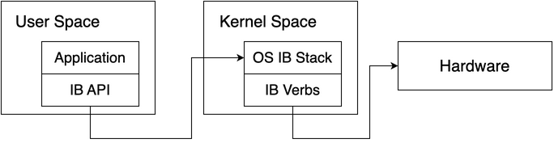

# RoaDMAp-to-RDMA
This repository is for those who initiate to study RDMA but have no idea what to do.

## Step

## Document
- [InfiniBand Architecture Specification Volume 1 (Release 1.2.1)](https://www.afs.enea.it/asantoro/V1r1_2_1.Release_12062007.pdf)
    - For now, just read the Chapter 3.
- [InfiniBand Architecture Specification Volume 2 (Release 1.2.1)](https://www.afs.enea.it/asantoro/V2r1_2_1_Release.pdf)
- [RFC 4296: The Architecture of Direct Data Placement (DDP) and Remote Direct Memory Access (RDMA) on Internet Protocols](https://www.rfc-editor.org/info/rfc4296)
    - about DDP and iWARP
    - RDMA is based on DDP
- [RFC 5040: A Remote Direct Memory Access Protocol Specification](https://dl.acm.org/doi/10.17487/RFC5040)

The specification of RoCEv2 is available to only IBTA users. (https://www.infinibandta.org/)

## Program
- [RDMA Core](https://github.com/linux-rdma/rdma-core)
    - userspace liblaries and daemons for RDMA programming.
